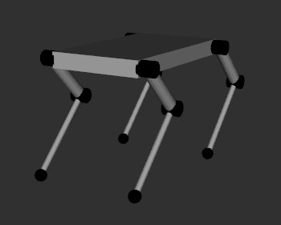
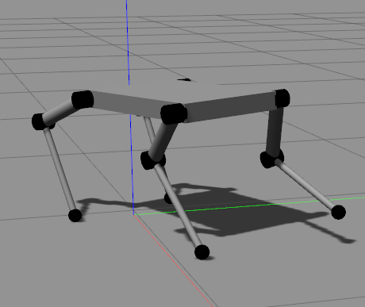
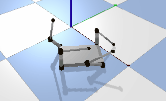

# legged_robot
ROS package; legged robot urdf and plugin  
based on https://demura.net/lecture/11554.html  



# in gazebo
Tested on Gazebo 9.0 and ROS melodic  
- plugin: gazebo_ros_legged_robot.so
- control_node: trot(incomplete)

this repository includes these launch:
- rviz.launch
- gazebo.launch

Try as follows:
```
roslaunch legged_robot display.launch
```
or
```
roslaunch legged_robot gazebo.launch
rosrun legged_robot trot_control_node
```
check joints and links on rviz

# in pybullet
on going...

